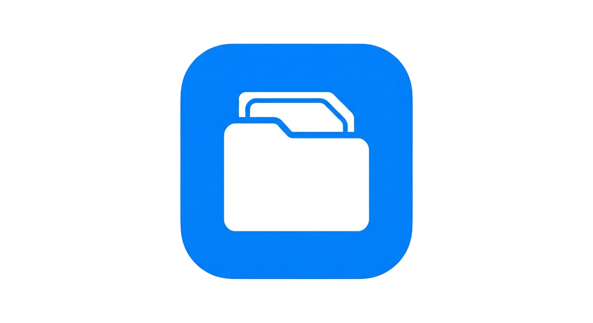
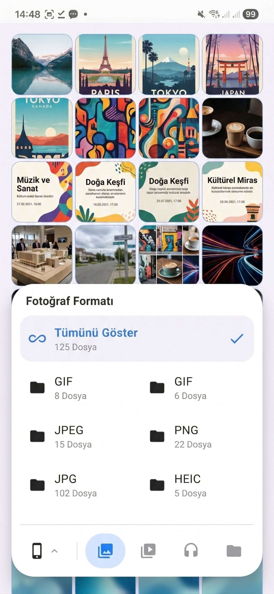

  
  
  
  
  <h1> Empty Media Manager</h1>
  
  
A high-performance Android media and file manager featuring an expandable navigation tray, advanced media gallery, and integrated multimedia players.

  

---

##  Overview

**Empty Media Manager** is a modern, user-centric file management solution built from the ground up with **Jetpack Compose**. It redefines mobile file navigation by consolidating all essential controls into a dynamic, expandable bottom tray, ensuring high accessibility and a clutter-free interface.

##  Key Features

* **Dynamic Navigation Tray:** An intelligent expandable dock that provides instant access to storage units (Internal, SD Card, USB) and media categories.
* **Smart Format Filtering:** Automatically groups and filters photos, videos, audio, and documents by their extensions (JPG, MP4, MP3, PDF, etc.).
* **Advanced Media Gallery:** Features a premium horizontal pager for full-screen viewing with a real-time filmstrip thumbnail preview.
* **Integrated Multimedia Players:** Seamlessly play videos and listen to music using an in-app player interface powered by Media3 ExoPlayer.
* **Optimized Performance:** Implements advanced **Lazy Loading** and pagination logic to handle thousands of files smoothly without lag.
* **Interactive Selection Island:** An iOS-inspired dynamic bar at the top for managing batch operations like Copy, Move, Share, and Delete.

##  Technical Stack

* **Language:** Kotlin
* **UI Framework:** Jetpack Compose (Declarative UI)
* **Multimedia Engine:** Media3 ExoPlayer
* **Image Processing:** Coil (Optimized image & video frame decoding)
* **Concurrency:** Kotlin Coroutines (Asynchronous file scanning)
* **Storage API:** Android File API & StatFs for real-time storage metrics

##  Screenshots

| Navigation Tray | Media Gallery | Audio Player |
| :---: | :---: | :---: |
| _Coming Soon_ | _Coming Soon_ | _Coming Soon_ |

##  Getting Started

### Prerequisites
* Android 8.0 (API level 26) or higher.
* Storage permissions (The app will request `MANAGE_EXTERNAL_STORAGE` on Android 11+).

### Installation
1.  Go to the [Releases](https://github.com/erogluyusuf/Empty-MediaManager/releases) page.
2.  Download the latest `.apk` file.
3.  Install it on your Android device and grant the necessary permissions.

---
## Screenshots

  

---

  Developed by <b>Yusuf Eroğlu</b>

